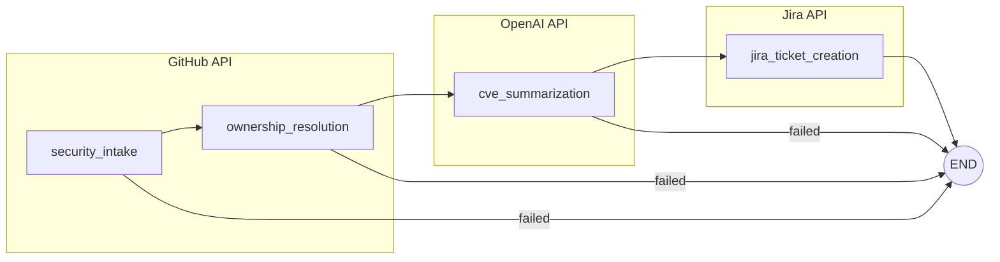

# TraceGuard

**Agentic vulnerability triage and ownership automation for GitHub repositories.**

TraceGuard closes the gap between security findings and developer action. It ingests GitHub Dependabot alerts, translates them into developer-friendly guidance using AI, resolves ownership, and creates actionable Jira tickets—all with full transparency and auditability.

## Features

- **GitHub Security Intake** — Fetches open Dependabot alerts with CVE metadata
- **CVE Summarization** — Transforms technical CVE data into clear, actionable summaries using GPT-4o-mini
- **Ownership Resolution** — Automatically determines who owns the fix via GitHub user lookup
- **Jira Ticket Creation** — Creates well-formatted tickets with severity-to-priority mapping and automatic assignment
- **Full Audit Trail** — Every agent decision is recorded and inspectable
- **Dry-Run Mode** — Preview tickets before creating them

## Architecture

TraceGuard uses [LangGraph](https://github.com/langchain-ai/langgraph) for workflow orchestration:



| Node | Description |
|------|-------------|
| `security_intake` | Fetches open Dependabot alerts from GitHub |
| `ownership_resolution` | Resolves repository owner (username, email) |
| `cve_summarization` | Transforms CVE data into developer-friendly summaries using GPT-4o-mini |
| `jira_ticket_creation` | Creates Jira tickets with severity-based priority and automatic assignment |

Each node records its inputs, outputs, and decisions to an audit trail for full transparency.

## Tech Stack

| Component | Technology |
|-----------|------------|
| API | FastAPI (async) |
| Workflow | LangGraph |
| Database | SQLAlchemy + SQLite |
| UI | Streamlit |
| AI | OpenAI GPT-4o-mini |
| Integrations | GitHub API, Jira REST API |

## Quick Start

### Prerequisites

- Python 3.14+
- [uv](https://github.com/astral-sh/uv) package manager
- GitHub personal access token (with `repo` and `security_events` scopes)
- OpenAI API key
- Jira Cloud instance with API token

### Installation

```bash
# Clone the repository
git clone https://github.com/your-username/traceguard.git
cd traceguard

# Install dependencies
uv sync

# Copy environment template
cp .env.example .env
# Edit .env with your credentials
```

### Running the Application

**Start the API server:**

```bash
uv run uvicorn traceguard.api.main:app --reload --host 0.0.0.0 --port 8000
```

**Start the Streamlit UI** (in a separate terminal):

```bash
uv run streamlit run ui/app.py
```

Then open http://localhost:8501 to access the UI.

## Environment Variables

Create a `.env` file with the following variables:

| Variable | Description | Example |
|----------|-------------|---------|
| `GITHUB_TOKEN` | GitHub personal access token | `ghp_xxxxxxxxxxxx` |
| `OPENAI_API_KEY` | OpenAI API key | `sk-xxxxxxxxxxxx` |
| `JIRA_HOST` | Jira Cloud instance URL | `https://your-domain.atlassian.net` |
| `JIRA_USER_EMAIL` | Email for Jira API authentication | `you@example.com` |
| `JIRA_TOKEN` | Jira API token | `ATATT3xxxxxxxxxxx` |
| `JIRA_PROJECT_KEY` | Target Jira project | `SEC` |

## API Reference

| Method | Endpoint | Description |
|--------|----------|-------------|
| `GET` | `/api/repos` | List repositories accessible by GitHub token |
| `POST` | `/api/jobs` | Create a new vulnerability scan job |
| `GET` | `/api/jobs` | List all scan jobs |
| `GET` | `/api/jobs/{id}` | Get detailed job information with alerts |
| `GET` | `/api/jobs/{id}/audit` | Get the full audit trail for a job |
| `GET` | `/health` | Health check endpoint |

### Create a Job

```bash
curl -X POST http://localhost:8000/api/jobs \
  -H "Content-Type: application/json" \
  -d '{
    "repo_name": "my-repo",
    "repo_full_name": "owner/my-repo",
    "repo_owner": "owner",
    "repo_url": "https://github.com/owner/my-repo"
  }'
```

## Project Structure

```
traceguard/
├── src/traceguard/
│   ├── api/                 # FastAPI application
│   │   ├── main.py          # App setup and middleware
│   │   └── routes/          # API endpoints
│   │       ├── repos.py     # Repository listing
│   │       └── jobs.py      # Job management & audit
│   ├── db/                  # Database layer
│   │   ├── models.py        # SQLAlchemy ORM models
│   │   └── session.py       # Async session management
│   ├── github/              # GitHub API client
│   │   └── client.py        # Alerts & user lookup
│   ├── openai/              # OpenAI API client
│   │   └── client.py        # CVE summarization
│   ├── jira/                # Jira API client
│   │   └── client.py        # Ticket creation
│   ├── graph/               # LangGraph workflow
│   │   ├── workflow.py      # Graph definition
│   │   ├── nodes.py         # Node implementations
│   │   ├── state.py         # State schema
│   │   └── runner.py        # Workflow executor
│   └── config.py            # Environment configuration
├── ui/
│   └── app.py               # Streamlit inspection UI
├── pyproject.toml           # Project dependencies
├── .env.example             # Environment template
└── README.md
```

## Workflow Details

### Severity to Priority Mapping

| CVE Severity | Jira Priority |
|--------------|---------------|
| Critical | Highest |
| High | High |
| Medium | Medium |
| Low | Low |

### Audit Trail

Every workflow step records:

- **Inputs** — What data the node received
- **Outputs** — What the node produced
- **Decisions** — Key choices made (e.g., "Found 3 critical alerts")
- **Errors** — Any failures encountered

Access the audit trail via `GET /api/jobs/{id}/audit` or through the Streamlit UI.

### Database Models

- **Job** — Scan job with status tracking
- **Alert** — Normalized Dependabot alert data
- **Owner** — Resolved repository owner
- **JiraTicket** — Created ticket reference
- **AuditArtifact** — Recorded decisions and outcomes

## Development

### Package Management

This project uses [uv](https://github.com/astral-sh/uv) for fast, reliable Python package management.

```bash
# Add a dependency
uv add package-name

# Sync dependencies
uv sync
```

### Database

SQLite database (`traceguard.db`) is created automatically on first API startup. To reset:

```bash
rm traceguard.db
```

### Code Standards

- **Async-first** — All I/O operations are async
- **Type hints** — Full type coverage with TypedDict for state
- **Immutable state** — LangGraph nodes return updates, not mutations
- **Explicit failures** — No silent errors; all failures are logged and audited

## License

MIT
